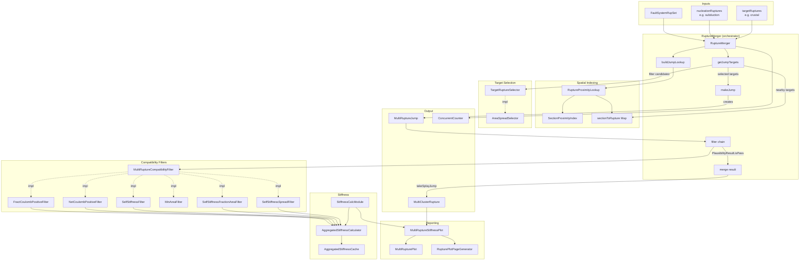

# RuptureMerger Data Flow

## Mermaid Diagram

## Summary

For each nucleation rupture, `RuptureMerger`:
1. Finds nearby targets via spatial index (`RuptureProximityLookup` → `SectionProximityIndex`)
2. Reduces candidates with `TargetRuptureSelector` (e.g. `AreaSpreadSelector`)
3. Creates `MultiRuptureJump` per candidate pair
4. Runs compatibility filter pipeline (Coulomb stiffness checks) — early exit on FAIL_HARD_STOP
5. On pass, creates `MultiClusterRupture` via `takeSplayJump`

Runs in parallel across all nucleation ruptures.

## Key Classes

| Class | Role |
|-------|------|
| `RuptureMerger` | Orchestrator |
| `RuptureProximityLookup` | Spatial index: section → nearby target ruptures |
| `TargetRuptureSelector` | Interface to filter/reduce target candidates |
| `AreaSpreadSelector` | Picks evenly-spaced ruptures by area |
| `MultiRuptureJump` | Bridge between two ClusterRuptures |
| `MultiClusterRupture` | Merged result (extends ClusterRupture) |
| `MultiRuptureCompatibilityFilter` | Filter interface |
| `StiffnessCalcModule` | Coulomb stiffness calculator + cache |
| `ConcurrentCounter` | Thread-safe progress counter |

## Filter Implementations (impl/)

| Filter | Mechanism |
|--------|-----------|
| `MultiRuptureCoulombFilter` | Base: Coulomb stress between ruptures |
| `FractCoulombPositiveFilter` | % of positive interactions ≥ threshold |
| `NetCoulombPositiveFilter` | Sum of all interactions ≥ threshold |
| `SelfStiffnessFilter` | Self-stiffness of combined rupture |
| `MinAreaFilter` | Minimum area for crustal/subduction |
| `SelfStiffnessFractionAreaFilter` | Fraction of sections with positive stiffness |
| `SelfStiffnessSpreadFilter` | Spread + threshold combined check |

## Reporting (report/)

| Class | Role |
|-------|------|
| `MultiRuptureStiffnessPlot` | Generates stiffness analysis visualizations |
| `MultiRupturePlot` | Per-rupture colored fault diagram |
| `RupturePlotPageGenerator` | Per-rupture HTML pages with multiple plots |
