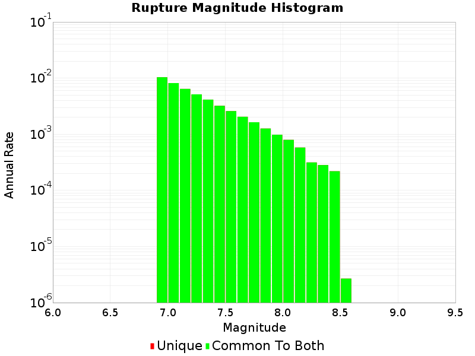
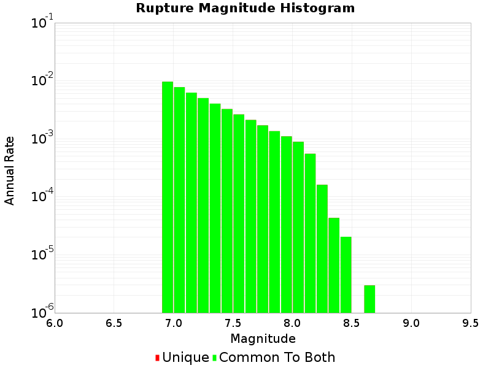
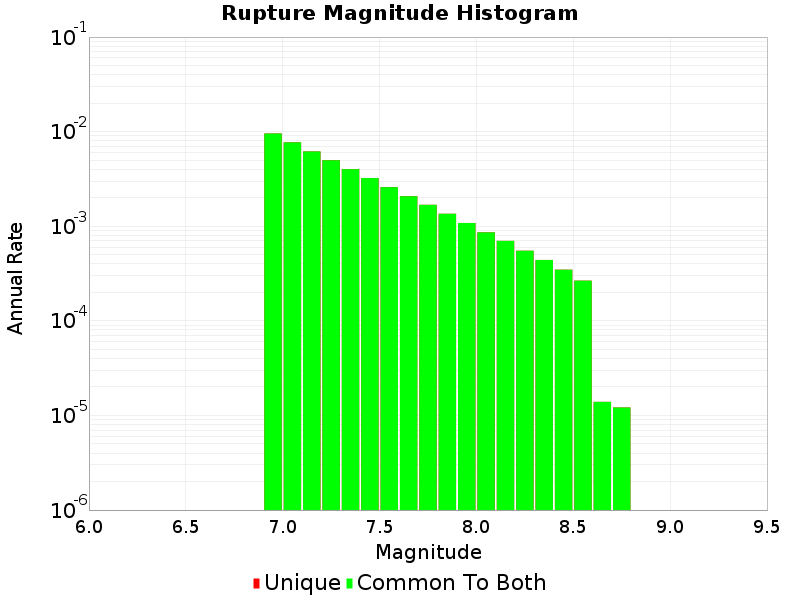
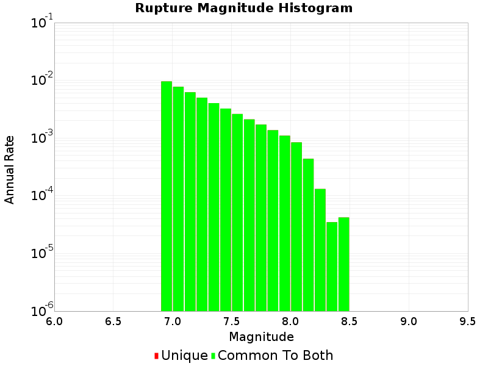
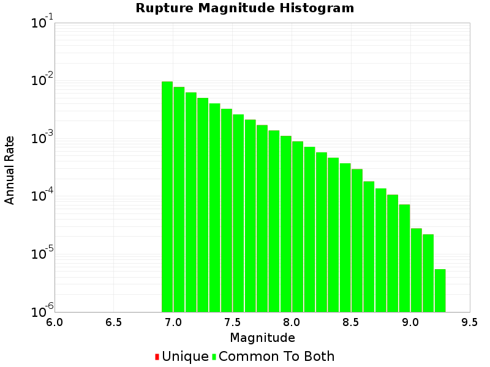

# Summary of MFD weighting sensitivity test

Test permuations of mfd_equality and inequality weighting as used to define the Tartet MFD inversion
constraints,

Short inversions of 10 minutes were performed and MagRate curves generated.

Note the default crustal weightings in UCERF3 were equality:10 vs in-equality:1000

| | Inequality 1000 | Inequality 100 | Inequality 10 | Inequality 0 |
|-----|-----|-----|-----|----|
| **Equality: 0** |  |  |  |  |
| **Equality: 10** |  |  |  |  |
| **Equality: 100** |  |  |  |  |
| **Equality: 1000** |  |  |  |  |

