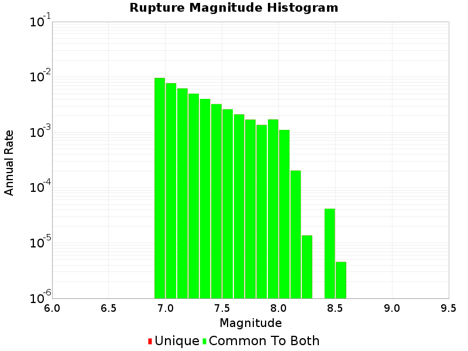

# Summary of MFD weighting sensitivity test

Test permutations of mfd_equality and inequality weighting are used to define the Target MFD inversion
constraints. Inversions of 10 minutes were performed and MagRate curves generated.

Note the default crustal weightings in UCERF3 were equality:10 vs in-equality:1000.

| | Inequality 0 | Inequality 10 | Inequality 100 | Inequality 1000 |
|-----|-----|-----|-----|----|
| **Equality: 0** |  |  |  |  |
| **Equality: 10** |  |  |  |  |
| **Equality: 100** |  |  |  |  |
| **Equality: 1000** |  |  |  |  |

