# Summary of MFD weighting sensitivity test

## test

Test permutations of mfd_equality and inequality weighting are used to define the Target MFD inversion
constraints. Inversions of 30 minutes were performed and MagRate curves generated.

| | Inequality 0 | Inequality 1 | Inequality 10 | Inequality 100 | Inequality 1000 |
|-----|-----|-----|-----|-----|----|
| **Equality: 0** | 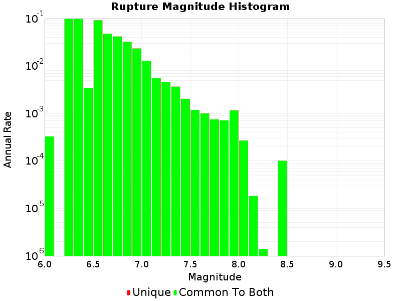 |  |  | 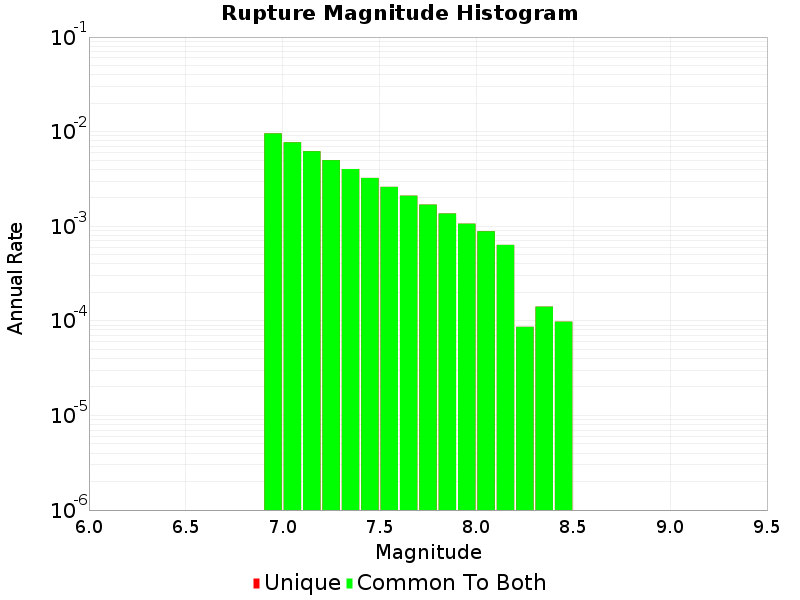 |  |
| **Equality: 1** | 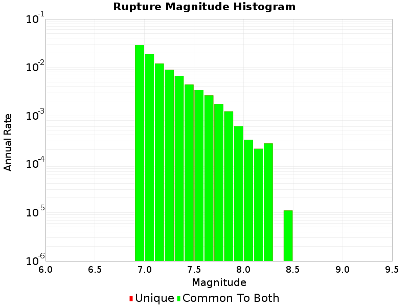 | 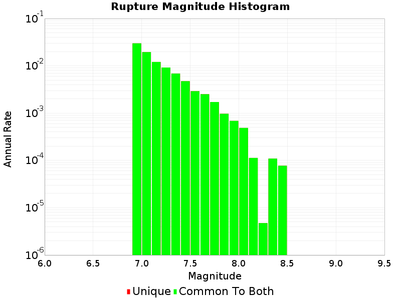 | 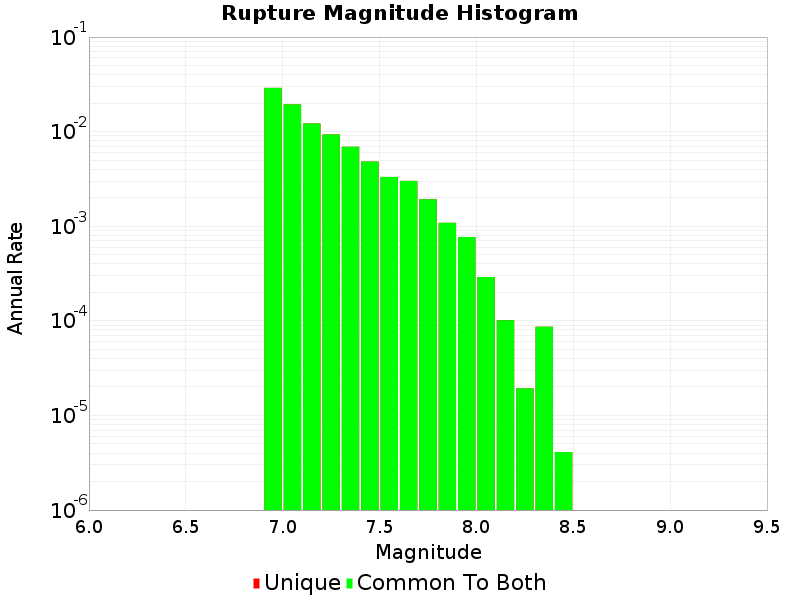 |  | 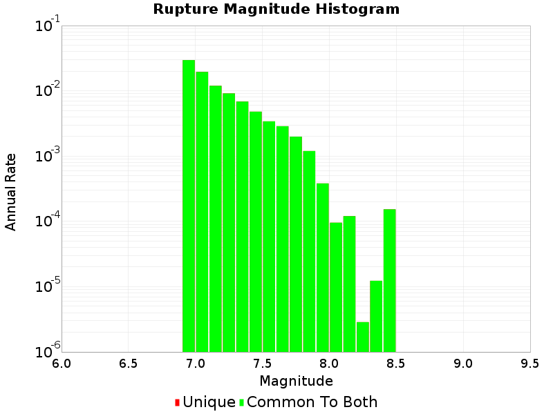 |
| **Equality: 10** | 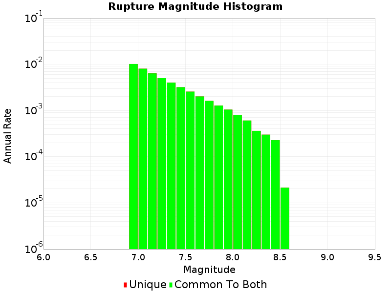 | 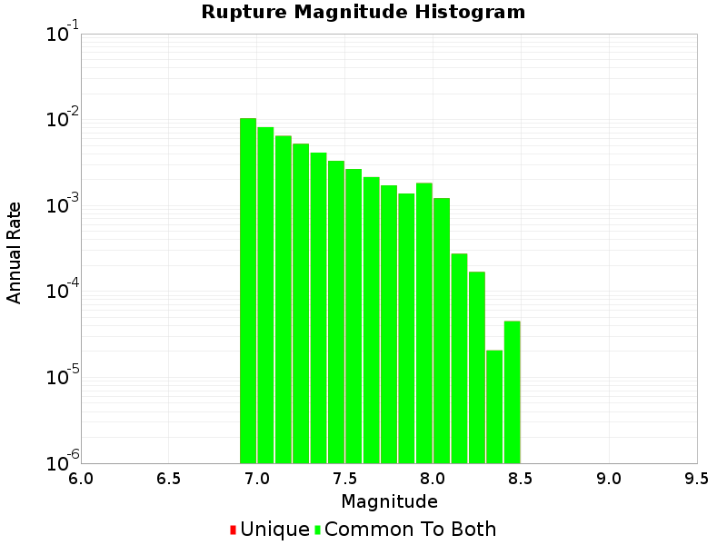 |  |  |  |
| **Equality: 100** | 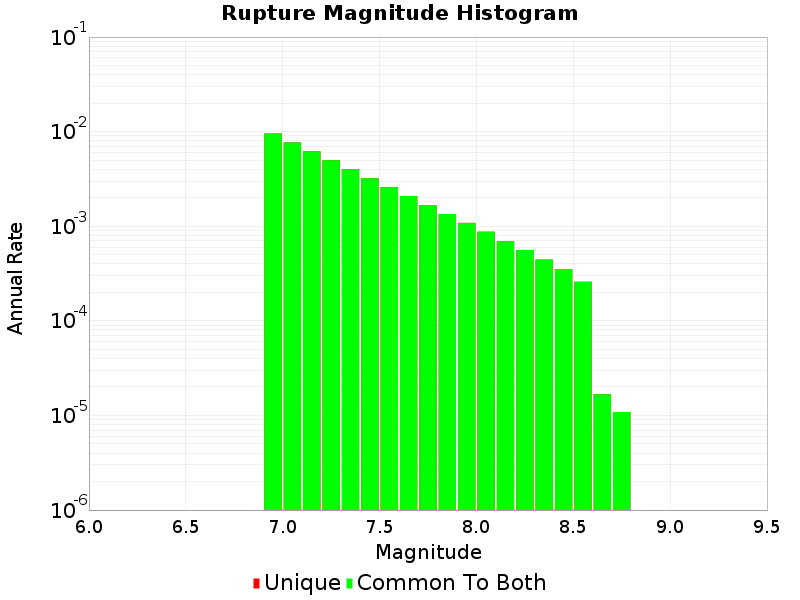 | 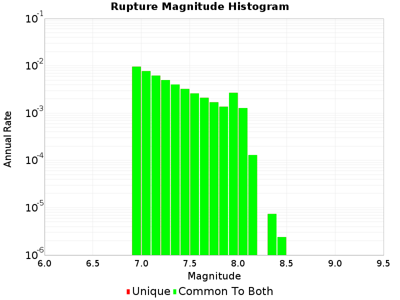 | 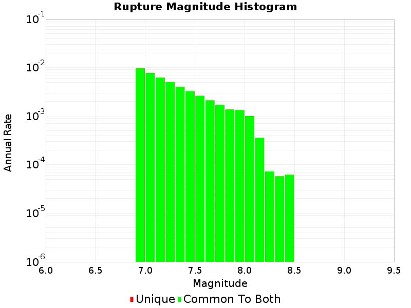 |  | 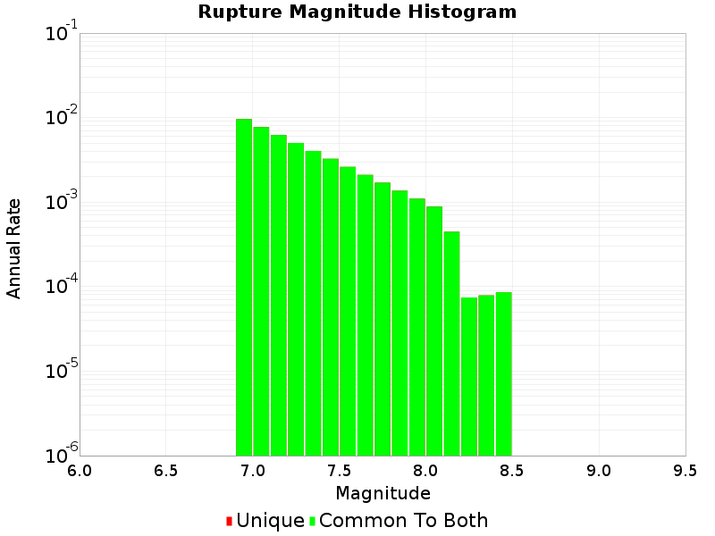 |
| **Equality: 1000** | 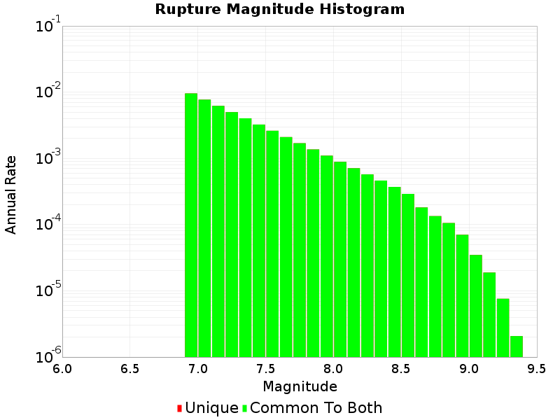 | 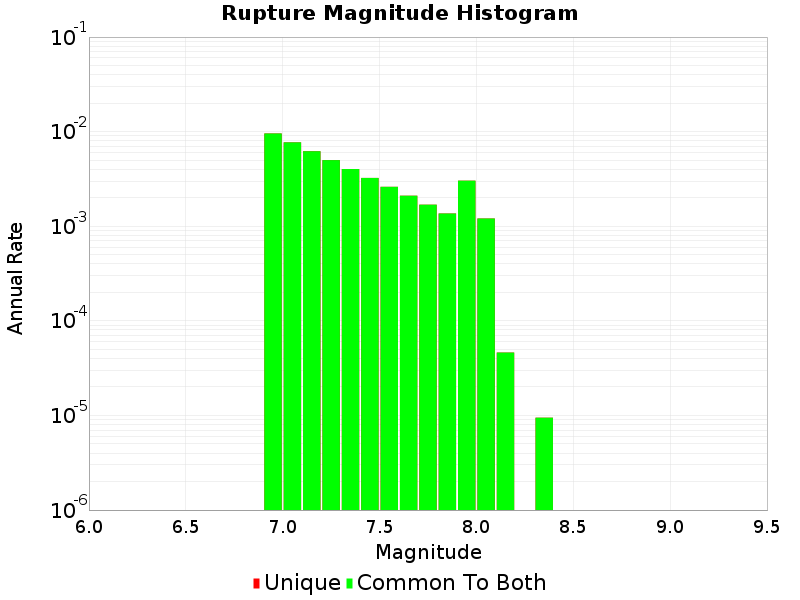 | 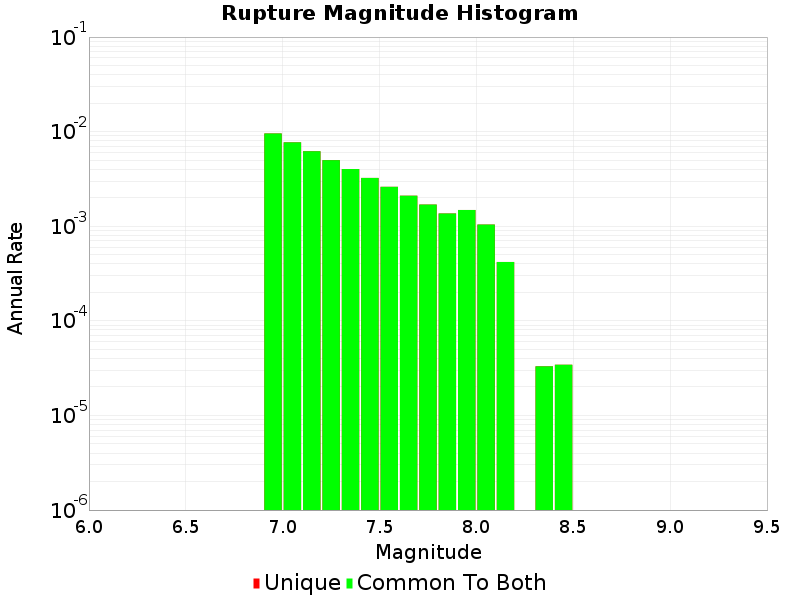 | 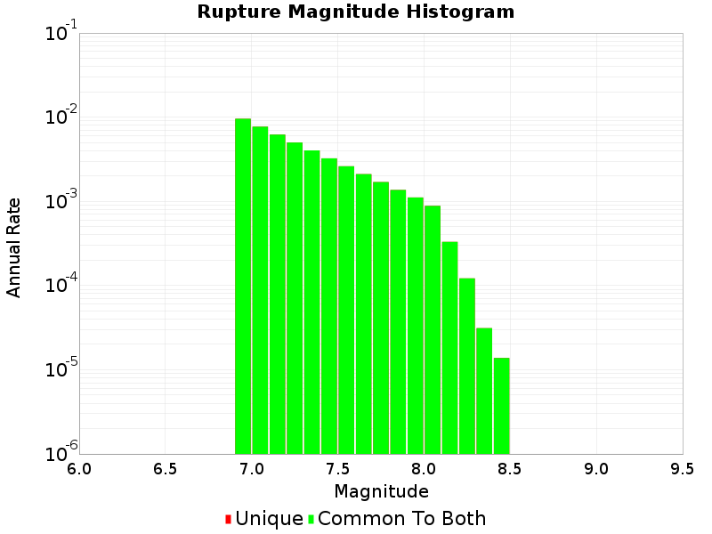 | 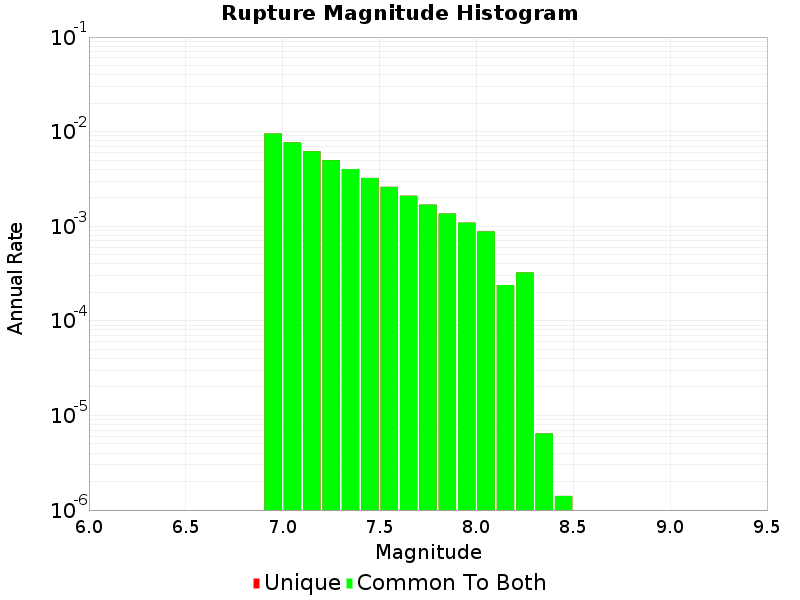 |
