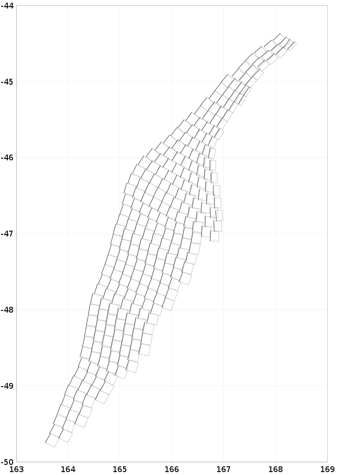

 ## Subduction Rupture Generation ##
 
Rupture generation for subduction faults is different from rupture generation for crustal faults. Crustal ruptures can only grow horizontally along the faults, while subduction ruptures can also grow up or down. There is no mechanism in `opensha` for generating subduction ruptures, and so we had to write custom code for `NZSHM22`.

Subduction faults are tiled into fault subsections that are organised in a grid. Here is the geometry of the `Puysegur` subduction fault:

For rupture generation, we consider these tiles arranged in a grid like this:

Subduction faults are stored in CSV files, and the row and column indices for the grid are already included in the files. The subsections are read from file by the `DownDipSubSectBuilder`.

A rupture on this fault is a group of sections that rupture together. The `DownDipPermutationStrategy` is responsible for creating all possible ruptures on the fault. It will only consider `rectangular selections` of cells on the grid. Here's an example of such a rectangular selection:

The subsections in a rectangular selection are written as a rupture into the rupture set if they meet a number of criteria that aree implemented in `DownDipConstraint`:

### Minimum Fill

A rectangular selection must not have too many empty cells. Here is an example of a good and a bad rectangle selection:

For `NZSHM22`, at least 50% of the cells in a selection had to not be empty.

### Aspect Ratio

For realistic ruptures, we enforce a minimum and maximum aspect ratio of the selection rectangle. For example, very long and narrow ruptures are unrealistic:

For `NSHM22`, we enforced aspect ratios to be between 2 and 5, meaning the rectangle had to be at least twice as wide as tall and at most five times as wide as tall.

Additionally, if a rectangle selection begins in the top row and reaches down to a certain threshold, the maximum aspect ratio is no longer enforced. This is so that ruptures can grow horizontally even if they have already reached the bottom of the fault and cannot grow further in that direction.

For `NZSHM22` the threshold was 8 rows deep.

### Connectedness

We also want to ensure that ruptures don't have gaps in them. For example, even with the minFill and aspect ratio constraints, a rupture like this would still be possible on the Puysegur fault, leaving two sections marooned in the top right corner:

The connectedness constraint ensures that all sections of a rupture are contiguous and each section can be reached from any other section without crossing an empty cell.

This constraint did not exist in `NZSHM22`.
