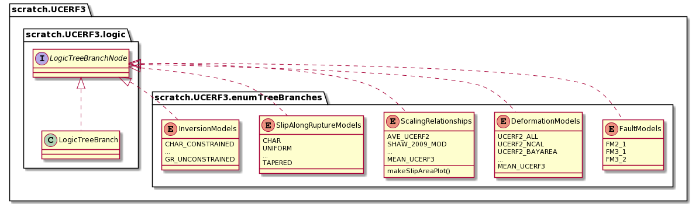
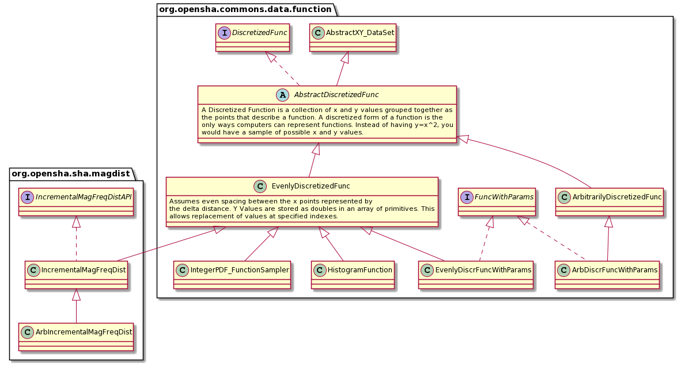
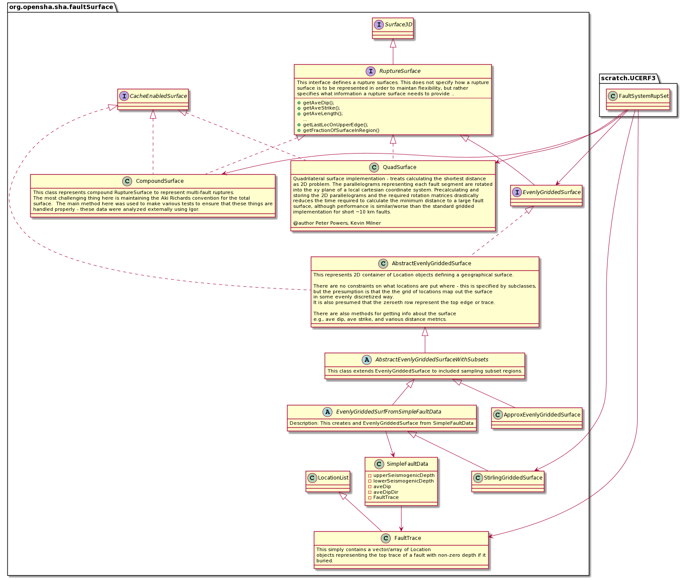
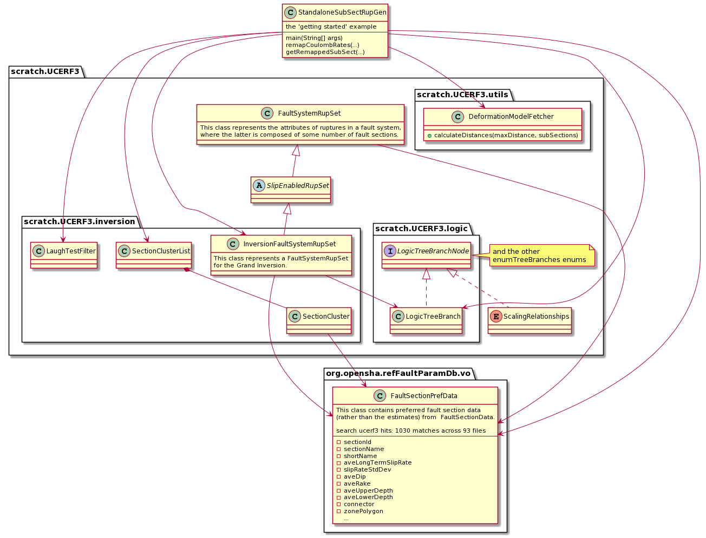

# Exploratory UML class views:

These diagrams were produced using [PlantUML](http://www.plantuml.com/planuml/uml) ++

 - dashed line, hollow head: **implements** (some interface)
 - solid line, hollow head: **extends** (aka **specializes or sub-classes**)
 - solid line, solid head: **depends on/references**
 - packages are sometimes simplified to improve layout
 
 The textual plantuml for each diagram can be [found here](./plantuml)
 
## Available ucerf3.enumTreeBranches
 

## Discretized functions

from the **opensha-core** & **opensha-commons** packages.

## Fault Surfaces

from the **opensha-core** package, an attempt to figure out the class hierarchy for the **StirlingGriddedSurface** & **ApproxEvenGriddedSurface** classes. Showing also some dependencies from the **UCERF3.FaultSystemRuptureSet** class.

## Standalone Sub-section Rupture Generator example

A view of the major dependencies for [this Rupture Generator](https://github.com/opensha/opensha-dev/blob/master/src/scratch/kevin/ucerf3/StandaloneSubSectRupGen.java), which is only dealing with surface faults, represented as **StirlingGriddedSurface**s

