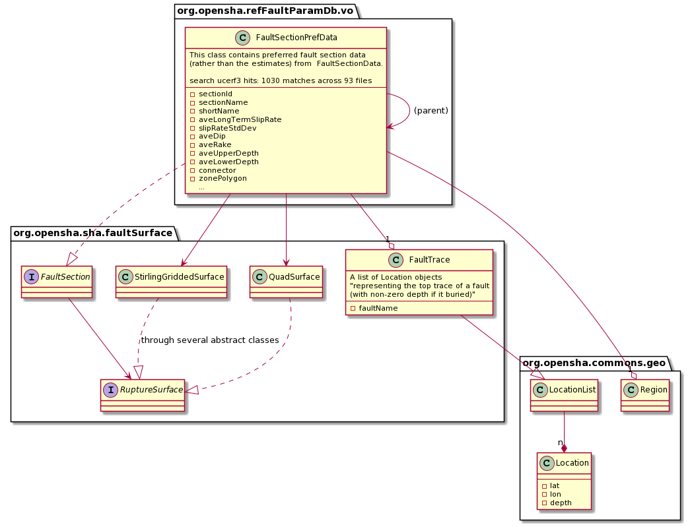

# FaultSectionPrefData

`FaultSectionPrefData` models the geometry and behavioral properties of a fault (-section).

## Behavioral Properties

In addition to static geometry, `FaultSectionPrefData` also has properties such as

- aveLongTermSlipRate
- slipRateStdDev
- aveRake
- couplingCoeff

## Static Geometry

The shape of the fault is modeled in `FaultTrace` as a chain of lat/lon/depth locations. In `FaultSectionPrefData`, this is extruded into a surface by supplying an average top and bottom depth. The average dip is used to orient the sequence of surfaces.

Fault Sections can be connected hierarchically into a single fault by specifying the parent section.

For example, the `DownDipSubSectBuilder` used to create the Hikurangi fault in [this demo](slab_interface_views.md) creates many `FaultSectionPrefData` instances with a `FaultTrace` each of only two locations and then uses the average top and bottom depth to extrude this line into a square. The average dip is then used to angle the square. All of these sections are linked to the same parent section.

### Subsections

It is possible to request a subsection from a `FaultSection` which will chop up the section into a list of `FaultSection`s of equal length. The subsections have the original section as their parent.

### Surfaces

`FaultSectionPrefData` can return two surface types that describe the geometry of the `FaultTrace`: `StirlingGriddedSurface` and `QuadSurface`. `QuadSurface` is more performant than `StirlingGriddedSurface` by treating distance calculations as 2D problems. 

## Classes

