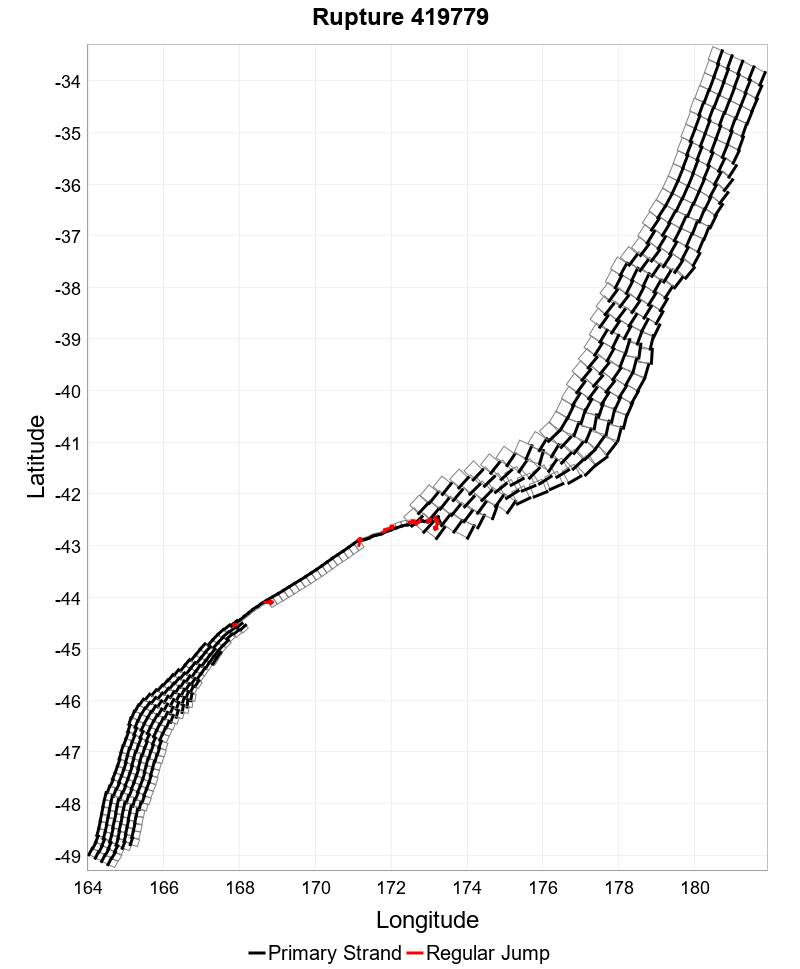
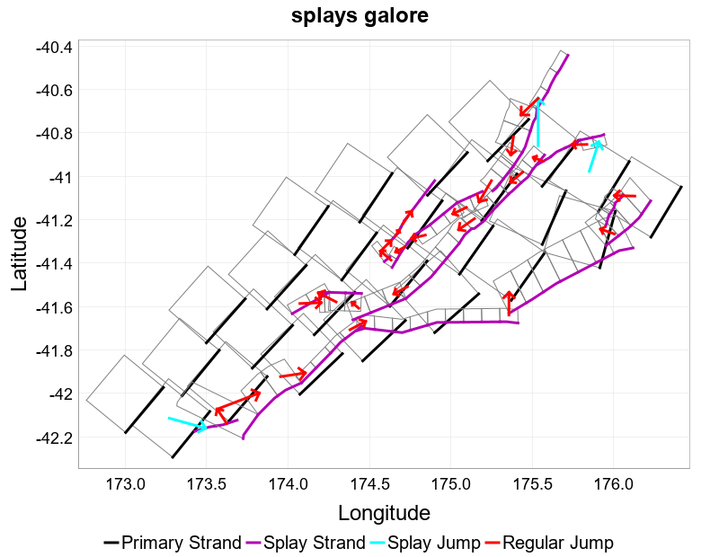
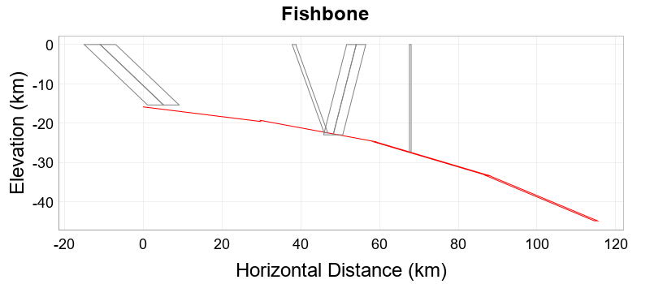

# EPIC: experiment with combining crustal and subduction faults in one rupture set #300

The goal of [epic #300](https://github.com/GNS-Science/nzshm-opensha/issues/300) was to create preliminary joint rupture sets and get an idea of the work required to fully implement this. 

These experimental classes are in `nz.cri.gns.NZSHM22.opensha.ruptures.experimental`

The following issues were identified:

Scientific:
- There does not seem to be a good model of how joint ruptures are formed or what their general shape is.
- How do we calculate magnitude?

Technical:

- Computational complexity based on the combinatorial explosion of combining subduction and crustal clusters.
    - Approaches to mitigate this include thinning and combining pre-made ruptures.
- Large rupture sets, at least during exploratory phase
    - OOM in opensha
    - external tools are struggling
- Joint ruptures most likely have splays. 
    - Parts of our NZSHM22 tooling explicitly and implicitly assume single-stranded ruptures.
- Subduction thinning is required, and possibly crustal as well.
    - We abandoned subduction thinning in NZSHM22.
- How do we visualise joint ruptures?
    - For example fishbone diagrams
    - How to distinguish crustal and subduction sections in ruptoons?
- What is the length of a joint rupture?
- How do we validate our ruptures if there's no cohesive scientific model?
    - possibly RSQSim output

Several ways to generate joint ruptures were investigated which I will describe in more detail in the rest of this document.

## Combine NZSHM22 Ruptures Into Single-Stranded Joint Ruptures



Driver class is [JointRupturePostProcessor](..%2F..%2F..%2Fsrc%2Fmain%2Fjava%2Fnz%2Fcri%2Fgns%2FNZSHM22%2Fopensha%2Fruptures%2Fexperimental%2Fjoint%2FJointRupturePostProcessor.java)

Heavy lifting happens in [JointRuptureBuilder](..%2F..%2F..%2Fsrc%2Fmain%2Fjava%2Fnz%2Fcri%2Fgns%2FNZSHM22%2Fopensha%2Fruptures%2Fexperimental%2FJointRuptureBuilder.java)

Approach: take an existing rupture set that contains both crustal and subduction ruptures and create a rupture set with joint ruptures by combining them.

Very limited in that it only allows jumps to the first and last section in the top row of a subduction rupture. Based on distance to first or last section in crustal fault.

We contributed improvements to `opensha` to enable some of these features, for example to be able to deal with large rupture index files.

## Combine NZSHM22 Ruptures Into Parallel Joint Ruptures



Driver class is in [JointRupturePostProcessor](..%2F..%2F..%2Fsrc%2Fmain%2Fjava%2Fnz%2Fcri%2Fgns%2FNZSHM22%2Fopensha%2Fruptures%2Fexperimental%2Fjoint%2FJointRupturePostProcessor.java)

Heavy lifting happens in [JointRuptureBuilderParallel](..%2F..%2F..%2Fsrc%2Fmain%2Fjava%2Fnz%2Fcri%2Fgns%2FNZSHM22%2Fopensha%2Fruptures%2Fexperimental%2FJointRuptureBuilderParallel.java)

Similar approach to building single-stranded ruptures, but here we combine a subduction and a crustal rupture if a minimum number of sections are close enough. More than one crustal rupture can be linked to a subduction rupture, resulting in more than one splay.

Any other physical features such as rake, dip, relative azimuth are not yet taken into account.

## Use Existing Coulomb Filters to Create Joint Ruptures

Driver class is [MixedRuptureSetBuilder](..%2F..%2F..%2Fsrc%2Fmain%2Fjava%2Fnz%2Fcri%2Fgns%2FNZSHM22%2Fopensha%2Fruptures%2Fexperimental%2FMixedRuptureSetBuilder.java)

This is a modified copy of [NZSHM22_CoulombRuptureSetBuilder](..%2F..%2F..%2Fsrc%2Fmain%2Fjava%2Fnz%2Fcri%2Fgns%2FNZSHM22%2Fopensha%2Fruptures%2FNZSHM22_CoulombRuptureSetBuilder.java) that uses the existing Coulomb filters in order to build joint ruptures.

[MixedGrowingStrategy](..%2F..%2F..%2Fsrc%2Fmain%2Fjava%2Fnz%2Fcri%2Fgns%2FNZSHM22%2Fopensha%2Fruptures%2Fexperimental%2FMixedGrowingStrategy.java) is used to grow crustal and subduction ruptures in one rupture set. Growing strategies only act on a single cluster and do  not create jumps.

[MixedPlausibleClusterConnectionStrategy](..%2F..%2F..%2Fsrc%2Fmain%2Fjava%2Fnz%2Fcri%2Fgns%2FNZSHM22%2Fopensha%2Fruptures%2Fexperimental%2FMixedPlausibleClusterConnectionStrategy.java) is used to generate jumps between crustal clusters as normal. It intercepts building possible connections with subduction faults and will simply create the shortest jump between the two clusters (if within `maxJumpDist`) without doing any further vetting. This is due to performance reasons.

We added some performance improvements to `opensha` but we have never been able to finish a rupture build due to the computational complexity.

Kevin writes about this:

```
In theory the Coulomb filters should generally work in this environment,
but the combinatorics would likely make it intractable (as you're
finding out). If you do keep going down that route, there are a couple
things to note that we might need to sort out:

   - Some of the Coulomb filters are testing in every possible path
     through the rupture, which is get tricky with down-dip subsectioning
     (as you have on the subduction zone). We would have to be careful
     that the prececessor/descendent relationships make sense at the
     ClusterRupture.getTreeNavigator() level.

   - Some of them assume uniform patch sizes (1km) on all surfaces, which
     would be really inefficient when applied to an enormous subduction
     source. You would probably want to discretized things at a different
     resolution to make it run, which isn't yet selectable (but I can
     make it so).

Maybe a more sensible starting point would be to just take the crustal
and subduction rupture sets and union them subject to some simpler
Coulomb rules. I could help you design them, such as fraction of
positive patch interactions filter  between the crustal and subduction
sources. That could potentially be a decently quick calculation.
```

## Thinning

With the sheer number of possible combinations of subduction and crustal ruptures, we need to consider thinning. The approach taken is to thin subduction and crustal ruptures before combining them into joint ruptures.

For this investigation, the driver class is [ThinningReport](..%2F..%2F..%2Fsrc%2Fmain%2Fjava%2Fnz%2Fcri%2Fgns%2FNZSHM22%2Fopensha%2Fruptures%2Fexperimental%2Freports%2FThinningReport.java)

Heavy lifting happens in [ThinningStats](..%2F..%2F..%2Fsrc%2Fmain%2Fjava%2Fnz%2Fcri%2Fgns%2FNZSHM22%2Fopensha%2Fruptures%2Fexperimental%2Freports%2FThinningStats.java)

The code tentatively applies thinning and then creates a report to see the impact.

Considerations:
- Thinning should not change the size or magnitude distribution of ruptures
- Thinning should not bias one region against another. Thinning needs to be applied evenly over NZ.

Explored strategies:

- Subduction filtering:
    - size increase needs to be at least 10%
    - ruptures of the same size avoid overlapping
- Crustal ruptures:
    - max cumulative azimuth change 10
    - max cumulative rake change 10

The explored crustal filtering is only meant to reduce and simplify the rupture set for development. We'll have to come up with better approaches if it's still required after Coulomb filtering.


## New Coulomb Filter

This is being developed outside the scope of this epic, but some of it is based on code written for this epic.

Kevin's suggestion:

```
For Coulomb stress change in our application, the question is "if slip
happens on this fault patch will it encourage or discourage slip on this
other fault patch?" Slip can be encouraged in 2 ways: it can increase
shear stress in the direction that the other fault wants to slip
(i.e., our slip pushed the other fault in the way that it wants to
slip thus encouraging it). It can also be encouraged by unclamping
the normal stress on the fault (reducing the frictional pressure
holding the fault in place and keeping it from slipping). Positive
ΔCFF means slip is encouraged on the other fault, negative discouraged.

For simple cases it does a good job of incorporating things like azimuth
change between faults (if they're in line and slip the same direction,
they're compatible), but it also does a good job of handling more complex
situations where the faults intersect at weird angles or have different
senses of slip (reverse -> strike slip, left lateral -> right lateral,
etc). Those complex cases would be hard to encode into simple rules in
terms of azimuth change.

My simplest initial idea is just to break down the ruptures into patches
separately (crustal patches and subduction patches), then using the
subduction patches as sources calculate ΔCFF from each subduction patch
to each crustal patch. Then look at the fraction of those interactions
that are positive, and keep the co-rupture if it's above some threshold
value. A pro of this method is that it's super simple, a con is that it
weights all interactions equally no matter how far they are. We could
instead sum the net ΔCFF across all interactions and keep it if it's net
positive, which would weight near interactions above far field
interactions. We might also want some combination of those filters.
```

## Notable utilities:

- [ManipulatedClusterRupture](..%2F..%2F..%2Fsrc%2Fmain%2Fjava%2Fnz%2Fcri%2Fgns%2FNZSHM22%2Fopensha%2Fruptures%2Fexperimental%2Fjoint%2FManipulatedClusterRupture.java) can combine two ruptures into a new rupture by creating a normal jump or a splay jump.
- [RuptureLoader](..%2F..%2F..%2Fsrc%2Fmain%2Fjava%2Fnz%2Fcri%2Fgns%2FNZSHM22%2Fopensha%2Fruptures%2Fexperimental%2Fjoint%2FRuptureLoader.java) can load a mixed rupture set and restore classes such as [DownDipFaultSection](..%2F..%2F..%2Fsrc%2Fmain%2Fjava%2Fnz%2Fcri%2Fgns%2FNZSHM22%2Fopensha%2Fruptures%2FDownDipFaultSection.java)
- [FishboneGenerator](..%2F..%2F..%2Fsrc%2Fmain%2Fjava%2Fnz%2Fcri%2Fgns%2FNZSHM22%2Fopensha%2Fruptures%2Fexperimental%2FFishboneGenerator.java) can generate fishbone charts of joint ruptures:
  
- [RuptureAccumulator](..%2F..%2F..%2Fsrc%2Fmain%2Fjava%2Fnz%2Fcri%2Fgns%2FNZSHM22%2Fopensha%2Fruptures%2Fexperimental%2FRuptureAccumulator.java) can be used to combine existing rupture sets into a new rupture set or to selectively add existing ruptures to a new rupture set.

