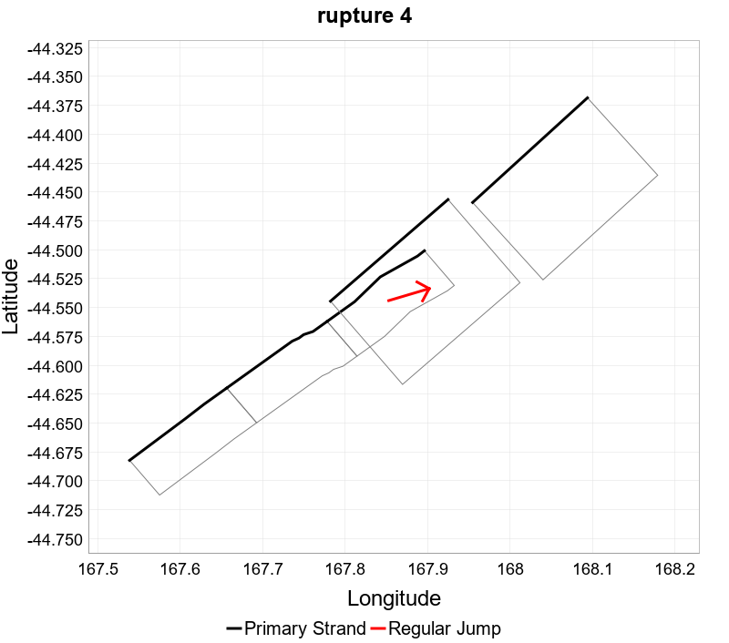
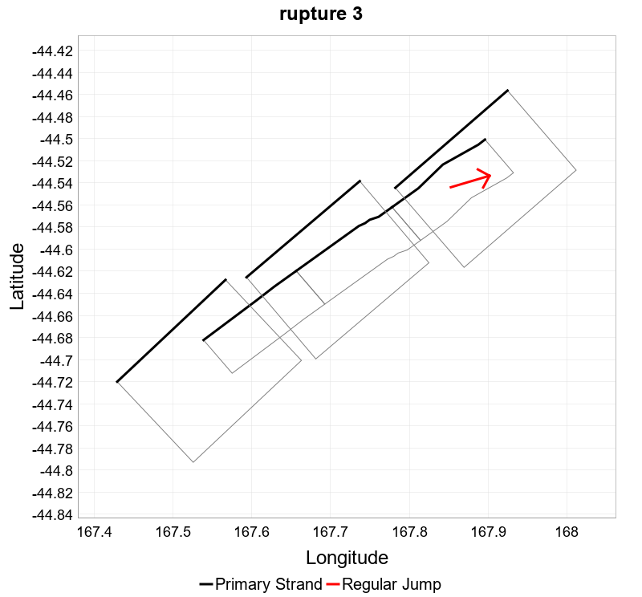

# Joint Rupture Generation

We need a catalogue of concrete, physical criteria to 

- create plausibility filters for rupture generation
- during development evaluate whether ruptures we have generated are plausible 

Some of these questions are based on [Subduction Interface & Upper Plate Fault Interactions:
Some additional rupture thoughts](https://nshmrevisionproject.slack.com/archives/C018ADJTE3D/p1596664565006700) by Russ.

## Magnitude

We have different `scaling relationships` for crustal and subduction ruptures. What should we use for ruptures that go between crustal and subduction faults? We could still use the NZSHM22 scaling relationships for pure crustal and pure subduction ruptures, and then a new scaling relationship for ruptures that go between regimes.

## Minimum Component Size

Can a rupture of any size be cross-regime? In [Subduction Interface & Upper Plate Fault Interactions:
Some additional rupture thoughts](https://nshmrevisionproject.slack.com/archives/C018ADJTE3D/p1596664565006700), Russ talks about "major interface rupture possibly accompanied by rupture of major upper plate fault(s)", and similar for the other direction. Does this imply that interface ruptures need to be large in order to make a jump to crustal? And that the crustal part will then also be large?

When we look at joint ruptures only, is this table correct for combinations of small and large crustal and subduction rupture components?

|                            | Small Crustal Component      | Large Crustal Component      |
|----------------------------|------------------------------|------------------------------|
| Small Subduction Component | no?                          | Crustal triggers subduction? |
| Large Subduction Component | Subduction triggers crustal? | yes                          |

And what is the cut-off between "small" and "large"?

## Connection Points

Russ mentioned a possible plausibility filter,

```
Rupture is only allowed to grow onto the interface down-dip of
junction with upper plate fault
```

This leads to the question of where on a subduction rupture we want to allow jumps to crustal. With NZSHM22, we did not allow splays, so all jumps from or to a string of sections on a fault were always at the beginning or the end of the string. If we want to still not allow splays, then we would have to define what this means for a subduction component of a rupture. 

Here are three examples of possible connection rules. Each figure shows a sample subduction rupture with all sections marked where we can jump to another fault.

In this example, there can be one connection on any of the left hand side edge sections of the rupture, and one connection on any of the right hand side sections.


Here is an example of a rupture that would be possible with this rule:


Here is a rule where we only allow jumps to be at the corners of the rupture:


And here is a rule that would satisfy:

```
Rupture is only allowed to grow onto the interface down-dip of
junction with upper plate fault
```


## Azimuth

For crustal ruptures, we prohibited large horizontal azimuth changes for jumps between faults. The general idea is that a rupture is relatively straight and does not loop back on itself.

Do we care about this for joint ruptures? 

For example, this rupture has a jump from three sections of a crustal fault to two sections of a subduction fault. The horizontal azimuth change is close to 0. 



And this rupture has the same three crustal sections, but the subduction part of the rupture loops back underneath the crustal part. The horizontal azimuth change is close to 180.



For ruptures involving both crustal and subduction sections, do we want to follow the crustal approach and keep the azimuth change low as in `rupture 4`? Or is `rupture 3` more realistic because the fault sections are more connected and are more likely to rupture together?

And what about faults that run horizontally perpendicular to each other?

## Max Jump Distance

For NZSHM22, we used a 5 km maximum jump distance between two sections of different faults. Faults that were more than 5 km apart could not have direct jumps between them. What should the max jump distance be for joint ruptures?

Russ writes that interface ruptures triggering crustal ruptures could be emulated 

```
Via the use of “connector faults” between the
interface and the upper plate faults that touch
the locked portion of the interface
```

[List of minimum distances to Puysegur in km](PuysegurDistances.csv)

[List of minimum distances to Hikurangi in km](HikurangiDistances.csv)

### Puysegur 5k

23 jumps between Puysegur and crustal faults are not greater than 5k. 

Map showing the Puysegur subduction fault plus all faults that have jumps not greater than 5k to Puysegur. For each fault, the section closest to Puysegur is drawn as a green polygon.


[jumps-5k.geojson](jumps-5k.geojson)

### Puysegur 10k

29 jumps between Puysegur and crustal faults are not greater than 10k.


[jumps-10k.geojson](jumps-10k.geojson)

### Puysegur 20k

31 jumps between Puysegur and crustal faults are not greater than 20k. 


[jumps-20k.geojson](jumps-20k.geojson)

### Hikurangi 5k

175 jumps between Hikurangi and crustal faults are not greater than 5k.


[jumps-hk5k.geojson](jumps-hk5k.geojson)

### Hikurangi 10k

192 jumps between Hikurangi and crustal faults are not greater than 10k.


[jumps-hk10k.geojson](jumps-hk10k.geojson)

### Hikurangi 20k

230 jumps between Hikurangi and crustal faults are not greater than 20k.


[jumps-hk20k.geojson](jumps-hk20k.geojson)


## Locked vs stable-sliding

Russ:

```
How to handle rupture width of upper late
faults that “touch” the stable-sliding portion of the
interface (not the locked portion)?
```

## Double Subduction?

Are we happy with a rupture that connects and Hikurangi and Puysegur?

## Coulomb Filtering

Do we want to use Coulomb filtering on top of all other constraints?