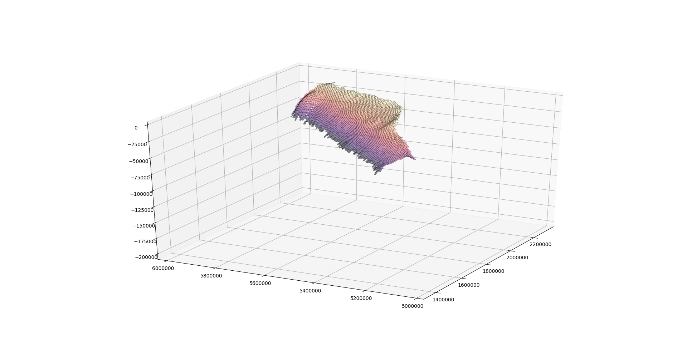
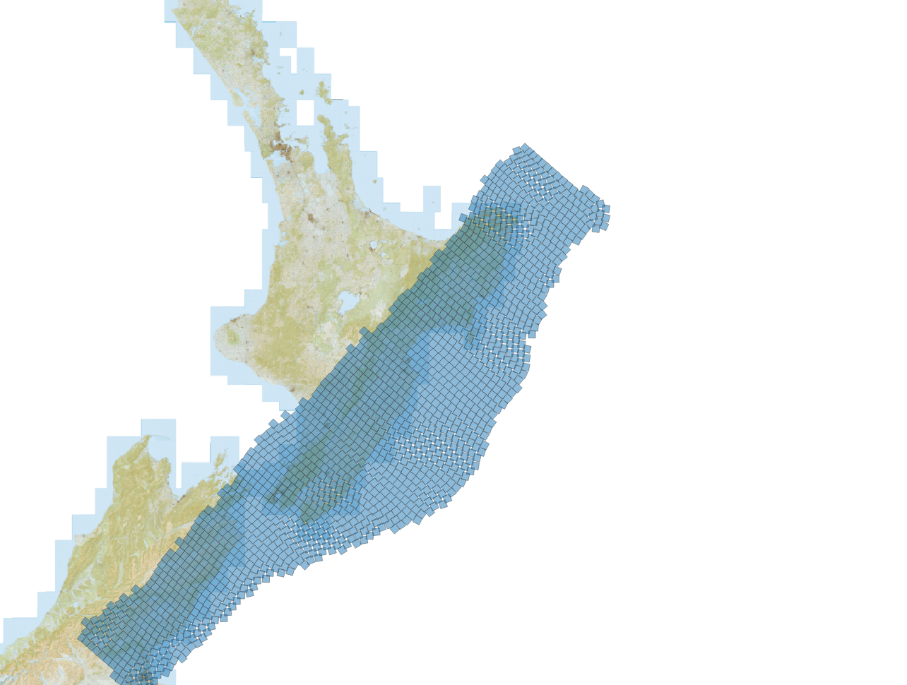
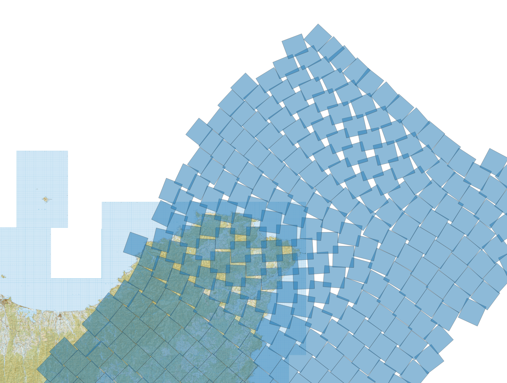

# Slab interface views:

These diagrams were produced by Andy for discussion re opensha, along with sometext (taken from Slack)

 
## Hikurangi sectioned into squares

@Andy : 

I’ve been playing around with subdivisions of the interface. Just wanted to check… Is there any reason why we shouldn’t just tile it into square patches of equal size? Two major advantages of that approach are: (1) all sources have the same area; and (2) sources are easy to represent in opensha using the existing functionality.
Here is a first-pass attempt, with 10km x 10 km patches (vertically exaggerated so patches don’t look square).
 

This approach does lead to a few areas where tiles overlap slightly, mostly around bulges in the interface. Is that likely to cause problems in opensha?

### Birds-eye view

### Birds-eye zoomed:

@MattG

good question. I am not sure if that will be a problem. I don't think, at least for starting, there is any reason they cant be the same size.  The size will define minimum possible earthquake sizes so we have to think carefully if they become too variable.